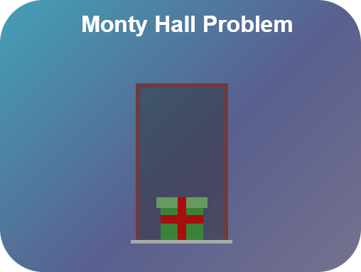
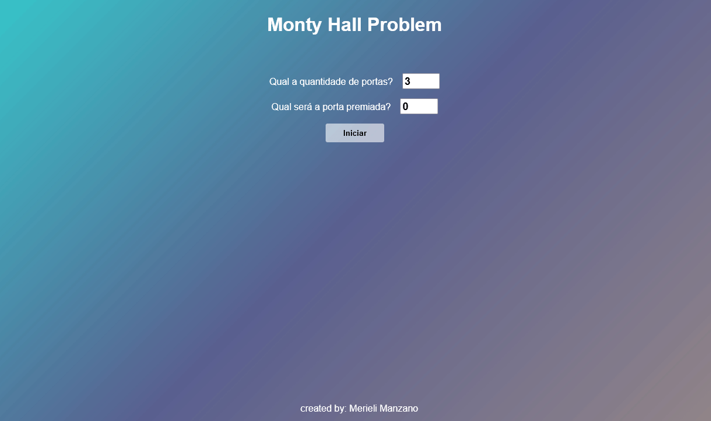

<h1 align="center">
    <br>
    
    <br>
    <br>
    Monty Hall Problem
</h1>

<p align="center">This is a simple Monty Hall Problem game developed to study the VueJS Framework, finished April 17, 2022.</p>

<!-- SHIELDS DO PROJETO -->
<p align="center">
  <a href="https://opensource.org/licenses/MIT">
    
  </a>
</p>
  
<!-- INSERIR GIF DEMO DO PROJETO -->
<div align="center">
  
</div>

<hr/>

## ⚡ Built With
-  **HTML e CSS**
-  **JavaScript**
-  **VueJS**


## 🗂 How To Use

<details>
<summary> <strong>Requirements</strong> </summary>

##### To clone and run the project:
- Git
- NodeJS

##### To Develop:
- Git
- NodeJS
- VueJS
</details>

## Project setup
```
npm install
```

### Compiles and hot-reloads for development
```
npm run serve
```

### Compiles and minifies for production
```
npm run build
```

## :octocat: Contributing

This project is for study purposes, so contact me and let me know your ideas.

All kinds of contributions are very welcome and appreciated!
   - ⭐️ Star the project
   - 🐛 Find and report issues
   - 📥 Submit PRs to help solve issues or add features
   - ✋ Influence the future of project with feature requests

## 🔖 License

This project is licensed under the MIT License - see the [LICENSE](https://opensource.org/licenses/MIT) page for details.

-------------------------------------

🤍 Made by <strong>Merieli Manzano</strong> Ⓜ

<p align="right">(<a href="#top">back to top</a>)</p>
